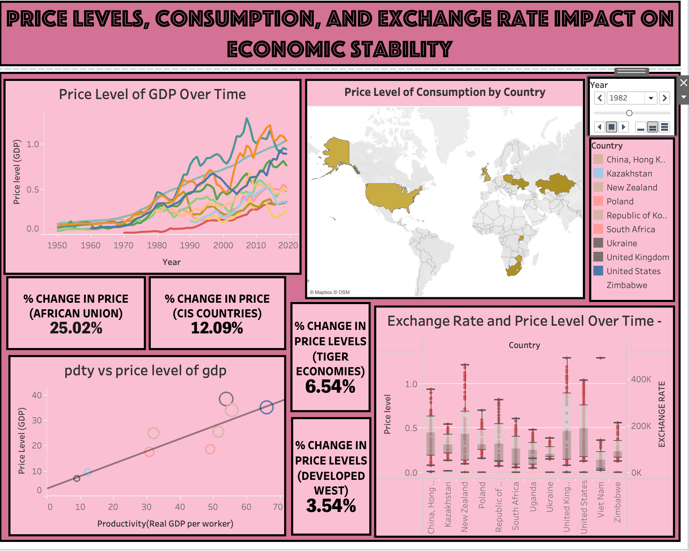

# Tableau Dashboards - Penn World Table Data

This repository showcases three interactive Tableau dashboards built using **Penn World Table** data. These dashboards provide insights into key economic factors, such as human capital, productivity, price levels, consumption, exchange rates, and economic growth. Each dashboard has been designed to help users explore complex data trends and make informed decisions.

## Dashboard Overviews

### 1. **Human Capital & Productivity Insights**
This dashboard focuses on the relationship between **human capital** (such as workforce education and skill levels) and **productivity** across various countries. It helps visualize the correlation between education quality, labor force skills, and economic productivity, allowing users to analyze key productivity drivers.

**Key Features:**
- Labor productivity comparison across regions.
- Correlation analysis between education levels and productivity.
- Visual trends in GDP per hour worked and educational attainment.

<<<<<<< HEAD
=======


>>>>>>> f89cd9f7089dfadd50bf3b7f7c8dbc7d3b101244
### 2. **Price Levels, Consumption, and Exchange Rate Impact on Economic Stability**
This dashboard examines the **impact of price levels, consumption patterns**, and **exchange rate fluctuations** on **economic stability**. It explores how economic stability is affected by inflation, currency exchange rates, and consumption trends.

**Key Features:**
- Price level variations and their impact on purchasing power.
- Exchange rate trends and their effect on consumption.
- Inflation rate comparison across different regions.

<<<<<<< HEAD
=======


>>>>>>> f89cd9f7089dfadd50bf3b7f7c8dbc7d3b101244
### 3. **Economic Growth and Regional Dynamics**
This dashboard analyzes **economic growth** and its **regional dynamics**, focusing on GDP growth and investment patterns across different regions. It provides insights into how regional economies are performing over time and identifies the growth drivers.

**Key Features:**
- Comparative analysis of GDP growth across countries and regions.
- Regional performance based on capital formation and investment trends.
- Insights into the shifting global economic dynamics.

<<<<<<< HEAD
=======


>>>>>>> f89cd9f7089dfadd50bf3b7f7c8dbc7d3b101244
## Technologies Used
- **Tableau**: The primary tool used for building interactive dashboards and visualizing the data.
- **Penn World Table Data**: A comprehensive dataset containing key economic indicators for various countries.

## Installation and Setup

To view the Tableau dashboards:
1. Clone or download the repository:
   ```bash
   git clone https://github.com/your-username/Tableau-Dashboards.git
